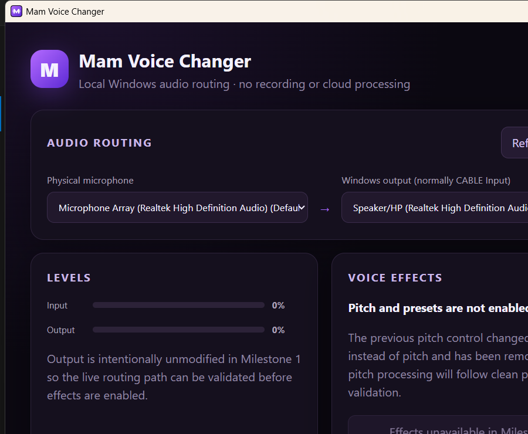

# Mam Voice Changer

Mam Voice Changer is a Windows 10/11 x64 desktop application built with Tauri 2,
React, TypeScript, Rust, and CPAL. It captures a physical microphone, applies a
local real-time DSP chain, and sends the result to an explicit processed playback
destination such as VB-CABLE's **CABLE Input**. An independent local monitor is
available for deliberate headphone testing and defaults off.



## Current implementation

- Windows input/output device enumeration and selection
- Common sample-rate negotiation and normalized `f32` processing
- Separate Use, Test, and Settings & Diagnostics pages
- One DSP worker with independent bounded processed-destination and monitor rings
- Low latency, Balanced, and Reliable buffering/prefill profiles
- Short-dropout concealment, staged stream recovery, and detailed location-specific counters
- Input gain, 20 Hz high-pass filtering, an optional soft speech expander, and output gain
- Signalsmith Stretch pitch shifting with formant compensation and independent
  formant shift
- Pitch-latency-aligned dry/wet mixing and bypass
- Warmth (200 Hz low shelf) and brightness (4 kHz high shelf)
- Linked 5 ms lookahead master limiter with a configurable digital ceiling
- Final smoothed mute stage
- Atomic live parameter snapshots, meters, counters, and latency estimates
- Versioned preset persistence in Tauri's application-data directory
- Three read-only built-in presets (`Natural`, `Warm tone`, and `Bright tone`) plus
  user presets created from the complete live DSP parameter snapshot
- Preset apply, save, rename, duplicate, delete, and reset workflows; the selected
  preset is restored at startup, and reset selects `Natural`
- Browser-safe frontend boundary when Vite is opened outside Tauri

Built-in presets may be applied or duplicated, but they cannot be renamed or
deleted. Saving always creates and selects a user preset. Deleting the selected
user preset falls back to `Natural`.

## Validation status

### Automated coverage present

Device-independent Rust tests cover presets, application-settings migration,
routing fan-out, reliability profiles, the expander, concealment, counters, and
bounded recovery policy. Frontend tests cover device selection, the three pages,
monitoring safety, navigation, and diagnostics. These are descriptions of test
coverage, not a claim that the commands below passed in the current checkout.

### Manual validation completed

On 2026-07-18, the Tauri debug executable launched, the React interface rendered,
and the available Realtek input/output endpoints were enumerated. The exact scope
and limitations of that session are recorded in the
[manual test plan](docs/manual-test-plan.md).

### Manual validation still required

Preset workflows across a real application restart, continuous monitored audio,
VB-CABLE routing, repeated start/stop and disconnection recovery, long-duration
stability, and Discord/OBS/TikTok Live Studio compatibility remain pending. A
planned compatibility milestone is manual validation work, not evidence that the
corresponding application features are absent.

### Deferred functionality

Recording, resampling devices without a common rate, AI/neural voice conversion,
voice cloning, custom virtual audio drivers, cloud processing, accounts,
telemetry, and non-Windows platforms are not part of the current prototype.

## Conservative defaults

The application starts on Use with monitoring off, the Balanced reliability
profile, 0 semitones pitch/formant, 35% wet, Gate/expander off,
0 dB input, -6 dB output, neutral tone controls, a -3 dBFS master ceiling,
limiter on, bypass off, and mute off.

The digital limiter prevents samples from exceeding its configured ceiling while
enabled. It cannot measure headphone volume, speaker output, acoustic feedback,
or safe listening exposure. Start with low Windows/headphone volume, use
headphones, and increase levels gradually.

## Prerequisites

- Windows 10 or Windows 11 x64
- Node.js 20 or newer and npm
- Rust stable with the MSVC toolchain
- Microsoft C++ Build Tools
- Microsoft Edge WebView2 Runtime
- [VB-CABLE](https://vb-audio.com/Cable/) when virtual-microphone routing is needed

Signalsmith Stretch and Signalsmith Linear are vendored under their MIT licenses
and compile statically into the application with MSVC. No Signalsmith DLL,
libclang installation, or runtime download is required.

## Development

```powershell
npm ci
npm run dev
```

`npm run dev` launches the Tauri desktop runtime. `npm run dev:web` intentionally
launches only Vite; native audio controls remain disabled there.

Choose a physical microphone as input and **CABLE Input** as the processed
destination. In the receiving application, choose **CABLE Output** as its
microphone. Without a real virtual capture endpoint, the app can test through
headphones but cannot appear as a Discord microphone.

## Validation commands

```powershell
npm ci
npx tsc --noEmit
npm test
npm run lint
npm run format:check
npm run build
cargo fmt --manifest-path src-tauri/Cargo.toml --check
cargo test --manifest-path src-tauri/Cargo.toml
cargo clippy --manifest-path src-tauri/Cargo.toml --all-targets --all-features -- -D warnings
cargo check --manifest-path src-tauri/Cargo.toml
npm run tauri -- build --debug --no-bundle --ci
```

Command presence does not imply a pass; report actual results from the checkout
being validated.
Runtime and audible behavior require separate manual validation with conservative
monitoring levels.

## Documentation

- [DSP design and parameters](docs/dsp.md)
- [Architecture](docs/architecture.md)
- [Audio routing](docs/audio-routing.md)
- [Prototype scope](docs/prototype-scope.md)
- [Manual test plan](docs/manual-test-plan.md)
- [Troubleshooting](docs/troubleshooting.md)
- [Technical stack, current structure, and roadmap](docs/Mam-Voice-Changer-Tech-Stack-and-Structure.md)

## Known limitations

- Input and output must expose a common sample rate.
- CPAL 0.15 device IDs are deterministic friendly-name fingerprints, not WASAPI
  endpoint GUIDs.
- Latency is estimated from configured buffers and reported DSP delay; it is not a
  measured acoustic round trip.
- Formant processing is spectral and polyphonic rather than a monophonic PSOLA
  model. Extreme pitch/formant combinations can still sound synthetic.
- Compatibility and subjective listening quality have not been established by
  compile-time checks.

